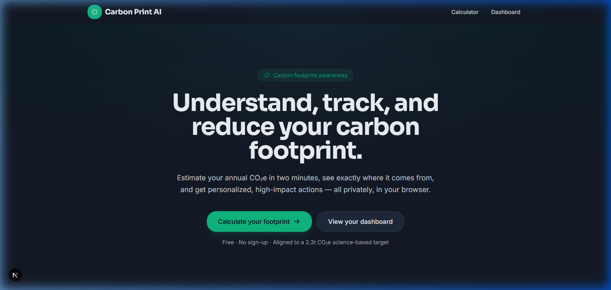
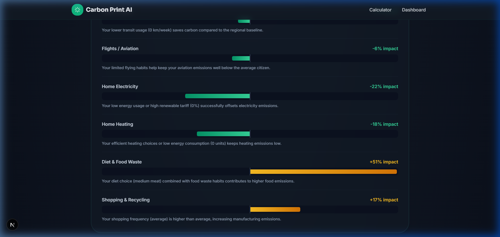

[](https://github.com/adityaa8077/Carbon-Print-AI/actions/workflows/ci.yml)

# 📊 Carbon Print AI — Advanced Personal Carbon Estimator & Insights Dashboard

> Analyze, monitor, and lower your personal greenhouse gas emissions — privately, securely, and entirely client-side.

**Live Application:** _



Carbon Print AI converts a brief, user-friendly questionnaire into a highly personalized carbon reduction roadmap. It calculates your estimated annual CO₂e footprint, partitions it across core lifestyle categories, compares your impact against regional averages and target climate thresholds, and applies game-theoretic AI attribution (SHAP) to highlight exactly which actions will yield the greatest savings.

---

## Platform Focus & Value Proposition

- **Actionable Personalization**: Generic environmental suggestions (such as "recycle more") lack individual context. Carbon Print AI acts as an intelligent carbon advisor, evaluating your specific inputs to pinpoint the precise sources of your greenhouse gas contributions and recommend high-impact behavioral changes.
- **Privacy-First Architecture**: Operating 100% in the client browser, the platform requires no accounts, uses no remote databases, and ensures your personal habits and details never leave your device.

---

## Core Capabilities

- **Multi-Vector Assessment**: Evaluates transport habits, household energy utilities, dietary footprints, and overall consumption habits in a streamlined six-step form.
- **Attribution & Dashboard**: Visualizes your annual impact using dynamic charts (breakdowns and shares), checks progress against the 1.5°C threshold (2.3t CO₂e/yr), and tracks historical emissions over time.
- **SHAP Explanation Engine**: Leverages game-theoretic feature attribution to show how individual decisions shift your footprint above or below the regional average.
- **Target Setting & Goal Tracking**: Allows users to set customizable carbon reduction goals and track progress across subsequent visits.



---

## Architecture & Calculation Engine

Unlike basic static calculators, Carbon Print AI uses a structured rules engine (`src/lib/tips-engine.ts`) to assess your input profile and identify only the most relevant interventions. For example, EV transition benefits are only computed if you drive a gasoline/diesel car, and savings are dynamically calculated from your actual weekly mileage.

### Technical Stack
- **Framework**: Next.js 15 (App Router)
- **Language**: TypeScript (Strict Mode)
- **Styling**: Tailwind CSS (Cyber-Biophilic Dark Palette)
- **Validation**: Zod (Strict schema validation for form entries and local storage reads)
- **Charts**: Recharts (with accessible data table alternatives)

### Operational Modules (`src/lib`)
- `calculator.ts`: Translates raw inputs into annualized emissions using DEFRA and EPA factors.
- `shap.ts`: Calculates marginal carbon contributions relative to average regional benchmarks.
- `tips-engine.ts`: Generates and ranks tailored climate actions based on savings.
- `storage.ts`: Handles secure browser persistence with schema-enforced validations.

---

## Sourcing & Assumptions

- **Approximate Estimates**: Emission values represent general educational approximations for carbon awareness, not legal audit-grade compliance reporting. Sourcing is detailed in `METHODOLOGY.md`.
- **Household Division**: Home energy usage (electricity, heating) is divided equally among members of the household.
- **Heating Units**: Inputs are entered in natural physical units (e.g., liters, m³, kg) to avoid asking users for obscure energy calculations (kWh).
- **Target Benchmark**: Aligned with the global 1.5°C climate pathway targeting a personal allowance of **2.3 tonnes CO₂e/year**.

---

## Code Quality & Standards

- **Strict Type Checking**: 100% strict TypeScript (no `any` types allowed).
- **Security Engineering**: Employs CSP (Content Security Policy) headers with strict-dynamic nonces (`src/middleware.ts`) to block cross-site scripting vulnerabilities.
- **Automated Verification**: Complete coverage (>98% statements/lines, 100% functions) using Vitest unit tests.
- **Accessibility (WCAG 2.1 AA)**: Strictly adheres to accessibility guidelines including full keyboard navigation, ARIA descriptions (`aria-describedby`), explicit labels, and alternate data tables.

---

## Running Locally

```bash
npm install
npm run dev        # Starts local server on http://localhost:3000
```

### Build & Run Commands

| Command | Action |
| --- | --- |
| `npm run dev` | Run development server |
| `npm run build` | Compile optimized production build |
| `npm run start` | Start built production server |
| `npm run test` | Run Vitest unit test suites |
| `npm run typecheck` | Execute TypeScript compiler checks |
| `npm run lint` | Check ESLint syntax guidelines |
